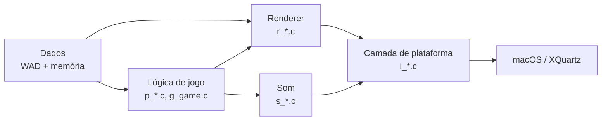

# DOOM (linuxdoom-1.10) — fork de estudo, porte para macOS Apple Silicon

Fork de estudo do código-fonte original do DOOM (`linuxdoom-1.10`,
GPLv2, id Software, dezembro de 1997). Uso solo/pessoal, sem intenção
de distribuição — só pra aprender lendo e mexendo num engine clássico
de verdade.

> **Plataforma-alvo do porte: macOS em Apple Silicon (chips da família
> ARM — testado num M1).** Só foi validado nessa arquitetura. O
> `Makefile` resolve os paths do Homebrew dinamicamente
> (`brew --prefix`), então em princípio deve compilar num Mac Intel do
> mesmo jeito — mas isso nunca foi testado, então trate como não
> suportado até alguém confirmar.

## O que este fork está fazendo

- **Porte para macOS** (Apple Silicon/ARM, clang) — o código original só
  compilava em Linux/X11 de 1997. Hoje compila e roda de verdade num Mac
  com chip ARM (M1 em diante) via XQuartz, com suporte a TrueColor,
  janela redimensionável e alguns bugs reais de portabilidade 64-bit
  corrigidos ao longo do caminho. Ver
  ["Rodando no macOS"](#rodando-no-macos) abaixo.
- **Exercícios de aprendizado** sobre o engine em si — leitura,
  documentação e pequenas mudanças pontuais no core (allocator de
  memória, IA dos monstros, etc.), catalogados em
  [`docs/notes/`](docs/notes/).

Nada disso muda o comportamento/jogabilidade do DOOM original — é o
mesmo jogo, só rodando num sistema que não existia quando o código foi
escrito.

## Arquitetura, em uma imagem



Visão bem macro: a lógica de jogo e o renderer nunca falam com
macOS/X11 diretamente — tudo passa pela camada de plataforma (`i_*.c`).
É essa fronteira que tornou o porte possível sem reescrever o engine.
Detalhamento completo (por arquivo, diagrama de um frame) em
[`docs/arquitetura.md`](docs/arquitetura.md).

## Rodando no macOS

### Pré-requisitos

- Xcode Command Line Tools (`clang`, `make`).
- [Homebrew](https://brew.sh) com `libx11`, `libxext` e `xorgproto`
  instalados (`brew install libx11 libxext xorgproto`).
- [XQuartz](https://www.xquartz.org/) (`brew install --cask xquartz`) —
  precisa ser instalado a partir de um terminal de verdade (o instalador
  pede senha de admin) e requer logout/login depois de instalado.
- Um `doom1.wad` (shareware, distribuição livre) — **não está neste
  repositório** (é dado de jogo licenciado separadamente pela id
  Software/ZeniMax). Baixe manualmente e coloque em `linuxdoom-1.10/`.

### Build

```
cd linuxdoom-1.10
make
```

Gera `linux/linuxxdoom`.

### Rodar

```
cd linuxdoom-1.10
make run
```

Compila se preciso, garante que o XQuartz está de pé e roda o jogo com
`doom1.wad`. Equivale a:

```
cd linuxdoom-1.10
open -a XQuartz          # garante que o servidor X está de pé
export DISPLAY=:0
./linux/linuxxdoom -iwad doom1.wad -4
```

A resolução interna do Doom é fixa em 320×200 — não dá pra pedir uma
resolução arbitrária, só escalar por um fator inteiro. `make run` usa
`MULTIPLY=4` por padrão (1280×800, upscale nearest-neighbor, o maior
suportado). Pra mudar:

```
make run MULTIPLY=2   # 640x400
make run MULTIPLY=3   # 960x600
```

A janela é redimensionável (arrastar borda ou usar o botão de
zoom/maximizar do macOS) — o conteúdo escala mantendo a proporção
320×200, com barras pretas centralizadas quando a proporção da janela
não bate exatamente.

Roda sem áudio (fora de escopo do porte por ora — ver
`docs/notes/porte-macos.md`).

### Controles essenciais

| Ação | Tecla |
|---|---|
| Andar | `↑` `↓` `←` `→` |
| Atirar | `Ctrl` (direito) ou `Enter` |
| Usar / abrir porta | `Espaço` |

Lista completa (trocar de arma, mapa, save/load, mouse, e como mudar
qualquer uma dessas teclas) em
[`docs/notes/controles.md`](docs/notes/controles.md).

## Documentação

- **[`docs/arquitetura.md`](docs/arquitetura.md)** — como as peças do
  engine se encaixam: camadas, diagrama de um frame (input → lógica →
  renderer → tela), e o que cada grupo de arquivo (`p_*`, `r_*`, `i_*`,
  etc.) faz.
- **[`docs/notes/`](docs/notes/)** — planos e ideias de estudo em
  andamento sobre este fork: o levantamento técnico completo do porte
  para macOS (incluindo os bugs reais de portabilidade 64-bit
  encontrados só rodando o binário), brainstorms de melhorias no core,
  e outros exercícios. Ver
  [`docs/notes/INDICE.md`](docs/notes/INDICE.md) para a ordem/prioridade
  atual.

## Estrutura de pastas

```
DOOM/
├── linuxdoom-1.10/     engine (código-fonte original + porte para macOS)
├── docs/
│   ├── arquitetura.md  visão geral de arquitetura (este documento, em detalhe)
│   └── notes/          planos e ideias de estudo em andamento
├── ipx/                driver original de rede IPX (DOS)
├── sersrc/             driver original de rede serial/modem (DOS)
├── sndserv/            processo externo de som original (Linux/OSS)
├── README.md           este arquivo
├── README.TXT          carta original de John Carmack (dez/1997)
├── LICENSE.TXT         texto completo da licença (GPLv2)
└── Makefile            wrapper — delega para linuxdoom-1.10/Makefile
```

`ipx/`, `sersrc/` e `sndserv/` são drivers/utilitários auxiliares do
release original, específicos de DOS/Linux — fora do escopo do porte
para macOS, mantidos só por completude histórica.

## Histórico e licença

O código-fonte original é de dezembro de 1997. `README.TXT`, na raiz
deste repositório, é a carta original de John Carmack liberando o
código sob a licença que viria a se tornar a GPLv2 — vale a leitura
pelo contexto histórico. `LICENSE.TXT` tem o texto completo da licença.
Nenhum dos dois foi alterado.
