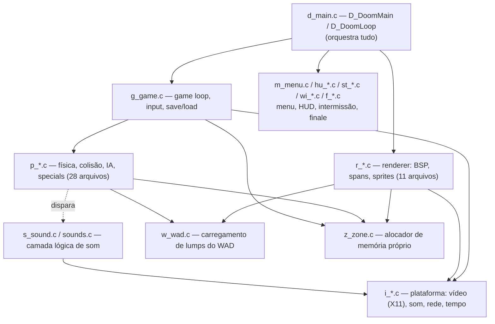
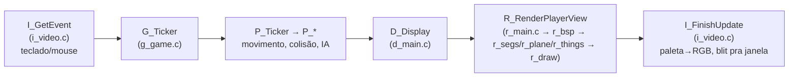

# Arquitetura do engine (`linuxdoom-1.10`)

Guia curto de como as peças do código se encaixam — não reescreve nada
em detalhe (para pontos de estudo específicos, ver
[`docs/notes/melhorias-core.md`](notes/melhorias-core.md)), só mapeia
"o que mora onde" pra facilitar navegar o código pela primeira vez.

O engine não tem uma separação em pastas — os 62 arquivos `.c` de
`linuxdoom-1.10/` vivem todos juntos, organizados só pelo prefixo do
nome. Essa é a convenção original da id Software:

| Prefixo | Área | Arquivos |
|---|---|---|
| `d_*` | Orquestração geral / rede | `d_main.c`, `d_net.c`, `d_items.c` |
| `g_*` | Loop de jogo, input, save/load | `g_game.c` |
| `p_*` | Lógica de jogo: física, colisão, IA, specials | 28 arquivos |
| `r_*` | Renderer (software, BSP) | 11 arquivos |
| `i_*` | Camada de plataforma (vídeo, som, rede, sistema) | `i_video.c`, `i_sound.c`, `i_net.c`, `i_system.c`, `i_main.c` |
| `m_*` | Utilitários + menu | `m_menu.c`, `m_misc.c`, `m_fixed.c`, `m_random.c`, `m_argv.c`, `m_bbox.c`, `m_cheat.c`, `m_swap.c` |
| `hu_*` / `st_*` / `wi_*` / `f_*` | HUD, status bar, intermissão, finale/wipe | — |
| `s_*` | Som (camada lógica, acima de `i_sound.c`) | `s_sound.c`, `sounds.c` |
| `w_*` / `z_*` | Dados: WAD e memória | `w_wad.c`, `z_zone.c` |
| `v_*` / `am_*` | Vídeo utilitário / mapa automático | `v_video.c`, `am_map.c` |
| sem prefixo | Definições, tabelas, tipos globais | `doomdef.c`, `doomstat.c`, `dstrings.c`, `tables.c`, `info.c` |

## Camadas, em alto nível

Ideia central: **as camadas de cima (`p_*`, `r_*`, `g_*`) nunca chamam
X11/sockets/etc. diretamente** — tudo isso passa pelos arquivos `i_*.c`.
É essa fronteira que tornou o porte para macOS possível sem tocar em
praticamente nada fora de `i_video.c` (ver
[`docs/notes/porte-macos.md`](notes/porte-macos.md)): o resto do engine
não sabe nem se importa se está rodando em X11, framebuffer ou outra
coisa.

## Um frame, do input ao pixel na tela

O renderer (`r_*.c`) é um **software renderer baseado em BSP**: não
existe GPU/OpenGL aqui. `r_bsp.c` percorre a árvore BSP do mapa pra
decidir a ordem de desenho; `r_segs.c`/`r_plane.c`/`r_things.c` geram
"spans" e "colunas" de pixels (paredes, chão/teto, sprites); `r_draw.c`
é quem efetivamente escreve esses pixels no framebuffer de 320×200
(`screens[0]`, índices de paleta de 8 bits — não RGB). Só depois disso é
que `i_video.c` entra: converte esses índices pra RGB de verdade (via
`truecolorLUT`, ver porte para macOS) e manda pra janela.

## Camada de plataforma (`i_*.c`)

- **`i_video.c`** — janela/vídeo. Historicamente X11 puro; foi o arquivo
  que mais mudou no porte para macOS (suporte a TrueColor, resize de
  janela, fallback de shared memory — ver `porte-macos.md`).
- **`i_sound.c`** — interface de som. No original, processo externo via
  pipe (`SNDSERV`) ou OSS direto; no porte atual, roda mudo (ver
  "Decisões em aberto" em `porte-macos.md`).
- **`i_net.c`** — rede multiplayer via UDP sockets (BSD sockets puro,
  compilou sem mudanças no macOS).
- **`i_system.c`** — relógio/tempo (`I_GetTime`), `I_Error`/`I_Quit`
  (shutdown do processo), alocação de memória de baixo nível.
- **`i_main.c`** — ponto de entrada (`main`), só chama `D_DoomMain`.

## Dados: WAD e memória (`w_wad.c`, `z_zone.c`)

- **`w_wad.c`** — parser do formato WAD (header + diretório de lumps +
  leitura por nome/número). Todo asset do jogo (texturas, sprites,
  níveis, sons) é um "lump" dentro do WAD — não existem arquivos soltos.
- **`z_zone.c`** — alocador de memória próprio (zone allocator), no
  lugar de `malloc`/`free` cru pra a maior parte das alocações do jogo.
  Suporta tags de "purgabilidade" (`PU_STATIC`, `PU_LEVEL`, `PU_CACHE`,
  etc.) — memória `PU_CACHE` pode ser liberada automaticamente sob
  pressão, um cache rudimentar embutido no allocator. Ponto de estudo
  citado em `melhorias-core.md`.

## Lógica de jogo (`p_*.c`, `g_game.c`)

`g_game.c` é o orquestrador: loop de tics, leitura de input
(`G_BuildTiccmd`), gravação/playback de demo, save/load
(`G_DoSaveGame`/`G_DoLoadGame`, que delegam pro formato binário em
`p_saveg.c`). Os 28 arquivos `p_*.c` implementam a simulação em si —
alguns dos mais relevantes:

| Arquivo | Papel |
|---|---|
| `p_mobj.c` | Objetos móveis (monstros, projéteis, itens) — spawn, ciclo de vida |
| `p_map.c` / `p_maputl.c` | Movimento e detecção de colisão |
| `p_enemy.c` | IA dos monstros (ver também `docs/notes/ideia-astar.md`) |
| `p_inter.c` | Interações/colisões (dano, pickup de itens) |
| `p_setup.c` | Carrega a estrutura de um mapa a partir do WAD (linhas, setores, BSP) |
| `p_spec.c`, `p_doors.c`, `p_ceilng.c`, `p_floor.c`, `p_plats.c`, `p_lights.c`, `p_switch.c`, `p_telept.c` | Efeitos especiais de mapa: portas, elevadores, luz, teletransporte |
| `p_pspr.c` | Animação do sprite da arma em primeira pessoa |
| `p_user.c` | Estado do jogador (vida, câmera, etc.) |
| `p_saveg.c` | Serialização de save game (índices em vez de ponteiros — ver nota de portabilidade 64-bit em `porte-macos.md`) |
| `p_sight.c` | Linha de visão (usado pela IA) |
| `p_tick.c` | "Thinkers" — lista de objetos que recebem tic a cada frame |

## Renderer (`r_*.c`)

| Arquivo | Papel |
|---|---|
| `r_main.c` | Setup e loop principal de renderização |
| `r_bsp.c` | Percorre a árvore BSP do mapa |
| `r_segs.c` | Recorte de paredes/segmentos visíveis |
| `r_plane.c` | Desenho de chão/teto (visplanes) |
| `r_things.c` | Sprites (monstros, itens, decorações) |
| `r_draw.c` | Funções de baixo nível que escrevem pixels (spans/colunas) |
| `r_data.c` | Prepara texturas/patches pra renderização a partir do WAD |
| `r_sky.c` | Caso especial: céu é uma textura cilíndrica |
| `v_video.c` | Utilitários de vídeo (blit de patches, gamma) — não é `r_*` mas é vizinho de propósito |
| `am_map.c` | Mapa automático (tecla Tab) — um "mini-renderer" 2D à parte |

## UI, HUD e som

- **`m_menu.c`** — menu principal e telas de opção.
- **`hu_stuff.c`/`hu_lib.c`** — HUD (mensagens, chat).
- **`st_stuff.c`/`st_lib.c`** — status bar (vida, munição, cara do
  jogador).
- **`wi_stuff.c`** — tela de intermissão entre níveis.
- **`f_finale.c`/`f_wipe.c`** — tela de finale e o efeito de transição
  "melt" entre telas.
- **`s_sound.c`/`sounds.c`** — camada lógica de som (qual som tocar,
  volume por distância) — delega a reprodução de fato pra `i_sound.c`.

## Sem prefixo — definições globais

`doomdef.c`/`doomdef.h` (constantes e macros de plataforma, como
`SNDSERV` citado no porte), `doomstat.c` (variáveis globais de estado),
`dstrings.c` (strings de texto do jogo), `tables.c` (tabelas
trigonométricas pré-calculadas — ponto de estudo em
`melhorias-core.md`), `info.c` (tabela gigante de estados/frames de
cada tipo de objeto, gerada por ferramenta externa na época).
